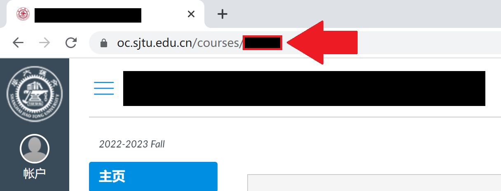

## SJTU Canvas 视频 (批量) 下载器【Mac版】

### 主界面展示


### 下载链接
- windows版本：[下载链接](https://github.com/Musicminion/sjtu-canvas-video-download/releases)
- Linux版本：[下载链接](https://github.com/Musicminion/sjtu-canvas-video-download/releases)
- M1的Mac版本：[下载链接](https://github.com/Musicminion/sjtu-canvas-video-download/releases)
- Intel的Mac版本：[下载链接](https://github.com/Musicminion/sjtu-canvas-video-download/releases)
- 如果你对安全性有要求，坚持要从GitAction构建的下载：请前往[Workflow runs · Musicminion/sjtu-canvas-video-download (github.com)](https://github.com/Musicminion/sjtu-canvas-video-download/actions)，但是注意：GitAction只有mac-intel、windows、linux-x86-64的系统版本哦


### 使用说明

课程ID:



- 勾选选项：**使用课程ID**
- 然后在**课程ID**里面输入形如`12345`的课程编号
- 再点击**更新课程ID**
- 最后点击**批量下载**，选择你需要下载的范围

### Windows用户使用方法

- 前往[发布下载链接](https://github.com/Musicminion/sjtu-canvas-video-download/releases/tag/v1.0)下载对应的Windows版本。
- 解压后打开`exe`文件即可

### Linux用户使用方法

- 首先，前往[发布下载链接](https://github.com/Musicminion/sjtu-canvas-video-download/releases/tag/v1.0)下载对应的Linux版本。
- 然后安装`aria2`，请执行`sudo apt-get update`和`sudo apt install aria2`
- 解压后打开可执行文件即可


### Linux用户源代码构建方法

目前只能使用源代码运行. 以Ubuntu 20.04为例. 请安装`python3`, `python3-pip`.

```sh
sudo apt install python3
sudo apt install python3-pip
```

安装`requirements.txt`中的软件包.

```sh
sudo pip3 install -r requirements.txt
```

需要安装`python3-tk`, `python3-pil.imagetk`, `aria2`.

```sh
sudo apt install python3-tk   # mac用户请安装brew并执行 brew install python-tk
sudo apt install python3-pil.imagetk
sudo apt install aria2
```

现在, 就可以使用:

```sh
python3 main.py
```

启动本程序了.

### MacOS用户使用方法

```
/bin/bash -c "$(curl -fsSL https://raw.githubusercontent.com/Homebrew/install/HEAD/install.sh)"
brew install python-tk aria2
pip3 install -r requirements.txt
```

